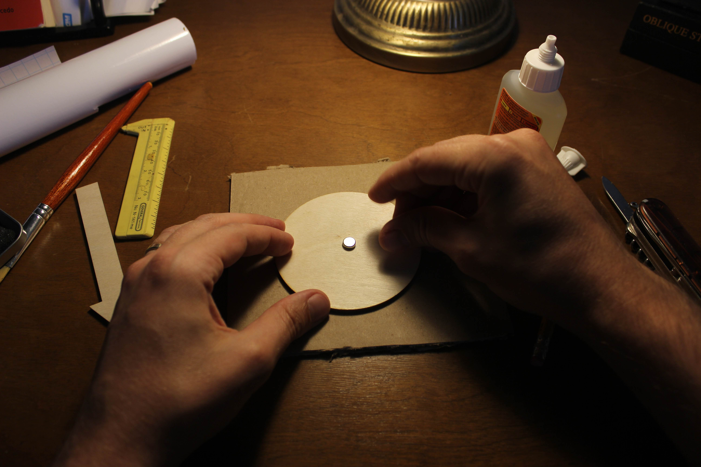

# Graphical model magnets

---
### Contact

Twitter: @landismj

Email: mlandis [at] gmail [dot] com

### In action

This is how they work. The magnets are strong enough to give a nice clacking sound.

[video]()

Teaching aid

[pic]()

Collaborate anywhere

[pic]()

Compact storage

[pic]()

Easy enough for a baby to use.

[pic]()

### Motivation

Probabilistic models are sets of random variables that share a dependency structure. Probabilistic graphical models (or PGMs) encode the structure of a probabilistic model as a graph. The graph represents the model's random variables with nodes and its dependencies with directed edges. PGMs are useful in modeling for many purposes: from designing efficient algorithms for inference methods, to blueprinting and specifying models, to teaching and communicating how particular models are built.

I study evolutionary biology. A major part of my research involves developing methods for the Bayesian phylogenetics package, [RevBayes](http://revbayes.com). In RevBayes, both the scripting language that biologists use to specify models and the computational back-end that's used for inference are designed upon a graphical architecture (papers for the [software](https://academic.oup.com/sysbio/article/65/4/726/1753608) and its underlying [design](https://academic.oup.com/sysbio/article/63/5/753/2847897)).

When I'm not developing RevBayes code, I use RevBayes to explore evolutionary models to understand how life evolved on the planet (examples of recent work [[1](https://academic.oup.com/sysbio/article/66/2/128/2669985)] [[2](https://www.biorxiv.org/content/early/2018/04/17/301887))]. A major part of this effort requires prototyping and designing new models. Similar to how programmers write pseudocode to first sketch out the logical skeleton of unwritten code, I sketch graphical models to initially design the logical skeleton of my model.

Drawing PGMs is a joyful experience for me, whether by hand or using graphing software like [TikZ](https://sourceforge.net/projects/pgf/). But as model complexity grows, so does the model's graphical representation. On particularly uninhibited days, building PGMs without proper urban planning results in a graph that longer fits on the board, becomes lopsided, etc. Redistributing the layout of nodes and edges generally means erasing and redrawing large portions of your graph -- perhaps multiple times, depending on how patient you are when brainstorming.

I've taught at the [Molecular Evolution Workshop](https://molevol.mbl.edu/index.php/Main_Page) in Woods Hole for the past few years. With others, I teach portions of the [Bayesian phylogenetics](https://revbayes.github.io/workshops/woodshole2018.html) unit, where I introduce concepts in phylogenetic model building using RevBayes as a platform. My presentation normally relies on either static premade images or handdrawn board work. While imagining more effective ways to present the material, magnets came to mind -- magnets where you could write on their surface and rearrange them in whatever way the group's curiosity might take us. I thought magnets like this might be available online, but my searches came up empty. So the only thing to do was to make some myself!

I'm more than pleased with how the graphical model magnets turned out. Not bad for the first try! And the students and teachers at the workshop seemed to enjoy them, too.

### Materials

I prototyped the design with cardboard cutouts to decide what size I liked. The below sizes are visible from about 40 feet away. These materials aim to balance cost and quality. About $40 was enough to build 20 nodes and 20 edges, which much of that being overhead from shipping:

- wooden shapes
  - circles, 3.5 inches wide [[link](https://www.etsy.com/listing/512797965/circle-shape-large-small-pick-size)]
  - squares, 3.5 inches wide [[link](https://www.etsy.com/listing/504579752/square-shape-large-small-pick-size)]
  - arrows (x2), 5.0 inches long [[link](https://www.etsy.com/listing/592074708/long-arrow-shape-large-small-pick-size)]
- small powerful magnets, 8x3mm [[link](https://www.amazon.com/gp/product/B07DD61G2F/ref=oh_aui_detailpage_o03_s00?ie=UTF8&psc=1)]
- adhesive dry erase contact paper, includes markers [[link](https://www.amazon.com/gp/product/B0784XN6Q4)]
- strong glue [[link](https://www.amazon.com/gp/product/B001L6CVS6)]
- black acrylic paint & brush (already had these)

### Assembly

After settling on the procedure, it took only 90 minutes of work to prepare all 20 nodes and 20 edges. Waiting for glue and paint to dry adds to the total time. Working in batches in a dedicated workspace speeds the process. Use cardboard in your workspace to protect your furniture from glue, paint, and knife scratches.

#### Nodes & Edges
  1. Mark the center of each shape
     
  2. Dab with glue
     
  3. Place magnet (match polarity across shapes)
     
  4. Apply pressure until dry (prevents tilting of magnets)
     

#### Nodes

  (Complete steps 1-4)
  
  5. Place node face down on to contact paper
     
  6. Trim edges with a fine, sharp edge
     

#### Edges
  
  (Complete steps 1-4)
  
  5. Paint black
     
   

#### Done

- And that's it!
 
  
### Ideas for improvements

There are a few ways to improve the design with additional materials and effort:

- Rather than using one central magnet, using 2--4 weaker magnets would improve stability of nodes and arrows against the board. Gouging spaces to embed magnets into the wooden shapes would also help stabilize the markers and improve how well the glue binds to the magnet.
- Adding magnetized connectors to nodes and edges so that they ``snap'' together would be very satisfying. Eliminating the need to match arbitrary polarities for connections seems like it'd require some clever and economical engineering.
- Painting permanent borders on to the nodes might give them a cleaner look, though I like that I can define the node's identity on the fly (e.g. stochastic vs. deterministic nodes). Permanently dyeing a few circular (stochastic) nodes gray for use as observed stochastic nodes would also be a nice touch. The directed edges could use a coat of sealant.
- Currently the edges are short and rigid, which could be a problem when longer or crossed edges are needed in complex graphs. As a hack, stacking extra magnets to the back of some edges would allow for crossing. Longer or curved arrows could be purchased through Etsy at higher cost (custom shapes).
